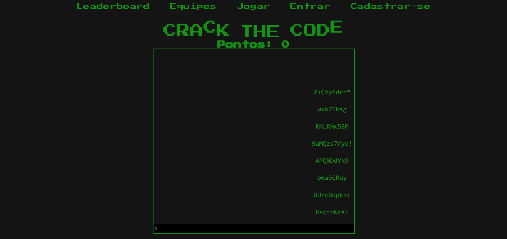
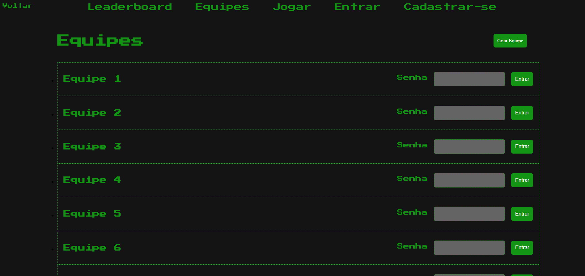
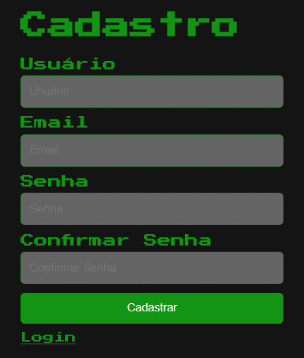
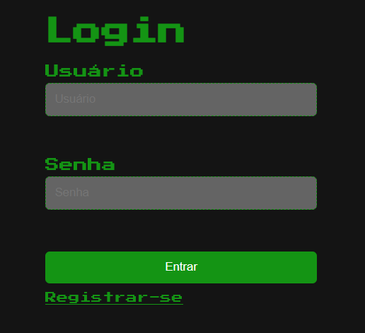
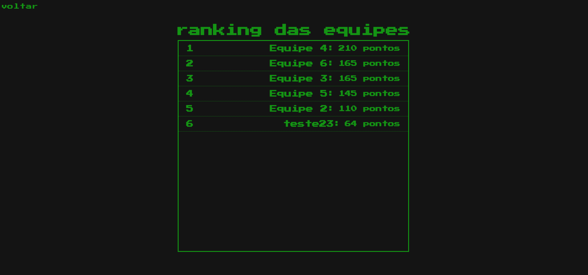

# Country_Search
The presented project is a typing game developed as the final evaluation for the Web Development I course in our Bachelor's degree program in System Analysis and Development. Please note that this repository is a fork of the original one.

Each programmer chose the area they would like to work on, and I specifically focused on database modeling, SQL queries, and PHP backend validations. Although some queries were not implemented due to the project's deadline, we decided to include them in the 'information.php' file.

Unfortunately, due to compatibility issues on Vercel, this specific project is no longer available online. However, feel free to explore the code and view the screenshots provided below.

## Technologies Used
- SQL
- PHP
- Javascript
- CSS
- HTML

## Features
- Resgistration and Login system
- Typing game screen
- Possibility to create a team
- Possibility to join a team (with password)
- Leaderboard containing top players

## Screenshots

  
  
  
  
  

## Acknowledgements
Special thanks to Professor Alexander Kutzke for teaching this course and providing the necessary guidance for the project.